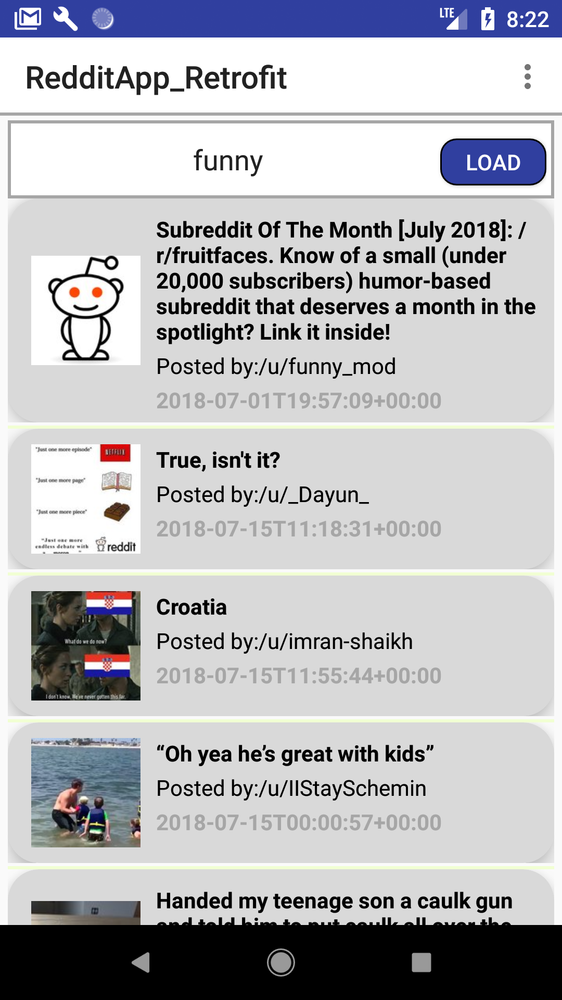
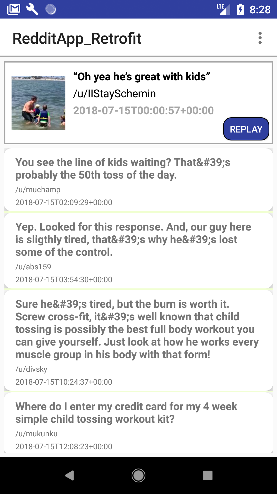
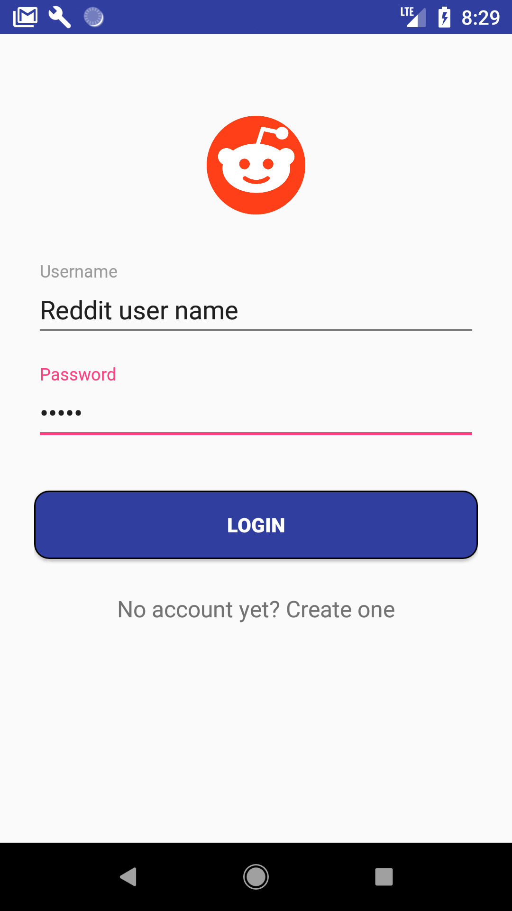
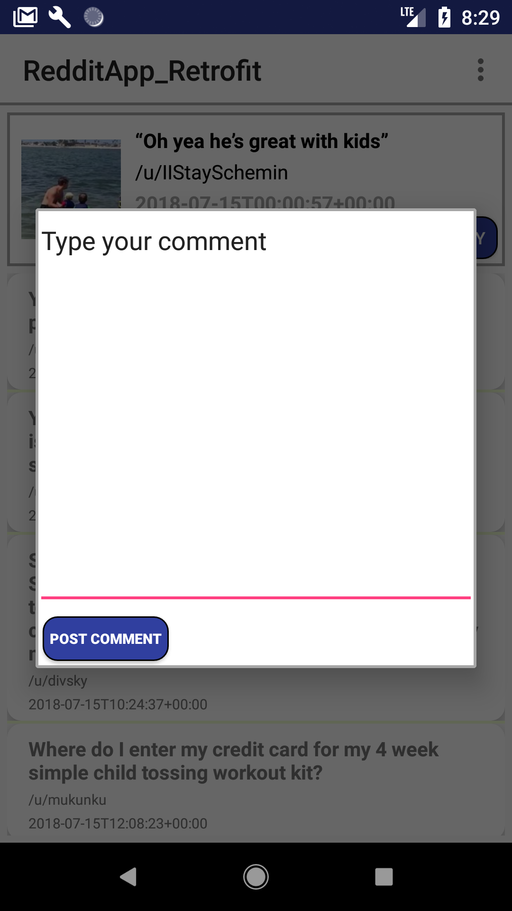

# RedditApp_Retrofit

  
  
  
  

## Included features
<ol>
<li>RSS Feeds</li>
<li>Parsing XML with Retrofit Library (extracting information from a website)</li>
<li>Parsing JSON with Retrofit Libary (posting and extracting information from a website)</li>
<li>POST requests with Retrofit Library</li>
<li>GET requests with Retrofit Library</li>
<li>Integrating an Android App with an existing webstie API (Reddit open source API)</li>
<li>Logging into your Reddit Account using the App</li>
<li>Viewing content in Reddit.com from the app</li>
<li>RecyclerView and CardViews to display content</li>
<li>WebViews</li>
<li>Basic Android Material Design</li>
<li>Comment on posts in subreddit</li>
</ol>
